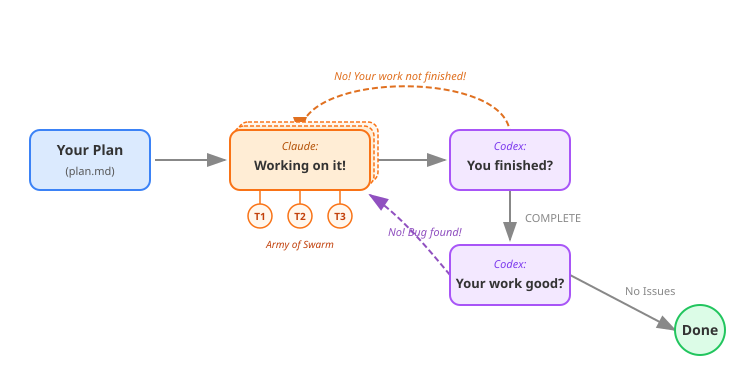
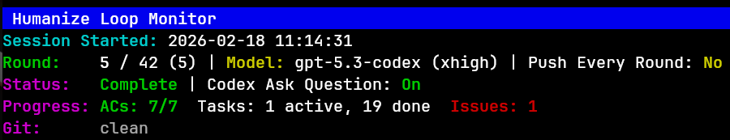

# Loop

**Current Version: 0.1.0**

A Claude Code plugin that provides iterative development with independent AI review. Build with confidence through continuous feedback loops.

## What is RLCR?

**RLCR** stands for **Ralph-Loop with Codex Review**, inspired by the official ralph-loop plugin and enhanced with independent Codex review. The name also reads as **Reinforcement Learning with Code Review** -- reflecting the iterative cycle where AI-generated code is continuously refined through external review feedback.

## Core Concepts

- **Iteration over Perfection** -- Instead of expecting perfect output in one shot, Loop leverages continuous feedback loops where issues are caught early and refined incrementally.
- **One Build + One Review** -- Claude implements, Codex independently reviews. No blind spots.
- **Ralph Loop with Swarm Mode** -- Iterative refinement continues until all acceptance criteria are met. Optionally parallelize with Agent Teams.
- **Begin with the End in Mind** -- Before the loop starts, Loop verifies that *you* understand the plan you are about to execute. The human must remain the architect. ([Details](docs/usage.md#begin-with-the-end-in-mind))

## How It Works

<p align="center">
  
</p>

The loop has two phases: **Implementation** (Claude works, Codex reviews summaries) and **Code Review** (Codex checks code quality with severity markers). Issues feed back into implementation until resolved.


## Install

```bash
# Add FrankDan77 marketplace
/plugin marketplace add FrankDan77/loop
# If you want to use development branch for experimental features
/plugin marketplace add FrankDan77/loop#dev
# Then install loop plugin
/plugin install loop@FrankDan77
```

Requires [codex CLI](https://github.com/openai/codex) for review. See the full [Installation Guide](docs/install-for-claude.md) for prerequisites and alternative setup options.

## Quick Start

1. **Generate an idea draft** from a loose thought (optional — skip if you already have a draft):
   ```bash
   /loop:gen-idea "add undo/redo to the editor"
   ```
   Output goes to `.loop/ideas/<slug>-<timestamp>.md` by default. Pass a `.md` path to expand existing rough notes. `--n` controls how many parallel directions explore the idea (default 6).

2. **Generate a plan** from your draft:
   ```bash
   /loop:gen-plan --input draft.md --output docs/plan.md
   ```

3. **Refine an annotated plan** before implementation when reviewers add comments (`CMT:` ... `ENDCMT`, `<cmt>` ... `</cmt>`, or `<comment>` ... `</comment>`):
   ```bash
   /loop:refine-plan --input docs/plan.md
   ```

4. **Run the loop**:
   ```bash
   /loop:start-rlcr-loop docs/plan.md
   ```

5. **Consult Gemini** for deep web research (requires Gemini CLI):
   ```bash
   /loop:ask-gemini What are the latest best practices for X?
   ```

6. **Monitor progress (in another terminal, not inside Claude Code)**:
   ```bash
   source <path/to/loop>/scripts/loop.sh # Or just add it into your .bashec or .zshrc
   loop monitor rlcr       # RLCR loop
   loop monitor skill      # All skill invocations (codex + gemini)
   loop monitor codex      # Codex invocations only
   loop monitor gemini     # Gemini invocations only
   ```

## Monitor Dashboard

<p align="center">
  
</p>

## Documentation

- [Usage Guide](docs/usage.md) -- Commands, options, environment variables
- [Install for Claude Code](docs/install-for-claude.md) -- Full installation instructions
- [Install for Codex](docs/install-for-codex.md) -- Codex skill runtime setup
- [Install for Kimi](docs/install-for-kimi.md) -- Kimi CLI skill setup
- [Configuration](docs/usage.md#configuration) -- Shared config hierarchy and override rules
- [Bitter Lesson Workflow](docs/bitlesson.md) -- Project memory, selector routing, and delta validation

## License

MIT
