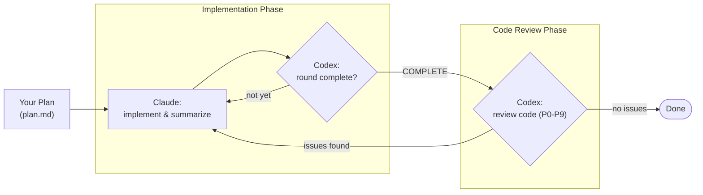

# Loop

**Current Version: 0.2.0**

Loop is a Claude Code plugin that turns a single build agent into a self-correcting pair: Claude writes the code, Codex reviews it independently, and the two keep exchanging feedback until your acceptance criteria are actually met.

## Overview

Most AI coding tools stop at the first draft. Loop treats that draft as the starting point. It runs a closed feedback loop between two independent agents so mistakes are caught and fixed automatically, round after round, instead of landing in your branch.

- **Claude** implements against your plan.
- **Codex** reviews the work from the outside, with no stake in defending it.
- The loop repeats until the code is clean and every acceptance criterion is satisfied.

## What is RLCR?

**RLCR** = **Ralph-Loop with Codex Review**. It builds on the ralph-loop idea (drive an agent in a tight, repeating cycle) and adds a second, independent reviewer so the builder is never grading its own homework. Read another way -- **Reinforcement Learning with Code Review** -- the name captures the same intent: output improves because every iteration is scored by an outside critic.

## How It Works



The loop moves through two phases:

1. **Implementation Phase** -- Claude works through the plan and summarizes each round; Codex checks the summary and sends it back until the round is marked `COMPLETE`.
2. **Code Review Phase** -- Codex reviews the actual diff and tags findings with `[P0-P9]` severity markers. Anything worth fixing routes back into implementation; a clean pass ends the loop.

## Features

- **Two independent agents** -- A builder (Claude) and an outside reviewer (Codex) with separate context, so review is not self-assessment.
- **Iterate until criteria are met** -- Rounds continue until every acceptance criterion passes and no issues remain, not until the first plausible-looking answer.
- **Plan-understanding pre-flight** -- Before the loop runs, Loop checks that *you* understand the plan you are about to automate, keeping the human as the architect. ([Details](docs/usage.md#begin-with-the-end-in-mind))
- **Optional parallel execution** -- Agent Teams mode can split work across multiple workers when a task benefits from parallelism.

## Requirements

- [Claude Code](https://docs.claude.com/en/docs/claude-code) with plugin support.
- [Codex CLI](https://github.com/openai/codex) for the review agent.
- Python 3.9 or newer for the `loop proof export`, `loop proof verify`, and `loop proof open` commands.
- (Optional) Gemini CLI for `/rloop:ask-gemini` deep-research queries.

## Install

Loop currently installs locally (Marketplace distribution is not yet available). Clone the repo and start Claude Code with the plugin directory:

```bash
git clone https://github.com/FrankDan77/loop.git
claude --plugin-dir /path/to/loop
```

See the full [Installation Guide](docs/install-for-claude.md) for prerequisites. Loop can also be installed as skills into other agent runtimes -- see the [Codex guide](docs/install-for-codex.md) and the [Kimi guide](docs/install-for-kimi.md).

### Command naming

Inside Claude Code the plugin commands use the `/rloop:` prefix (for example `/rloop:gen-plan`) to avoid clashing with the built-in `/loop` command. Outside Claude Code, the standalone CLI is still invoked as `loop` (for example `loop monitor`).

## Quick Start

1. **Generate an idea draft** from a loose thought (optional -- skip if you already have a draft):
   ```bash
   /rloop:gen-idea "add undo/redo to the editor"
   ```
   Output goes to `.loop/ideas/<slug>-<timestamp>.md` by default. Pass a `.md` path to expand existing rough notes. `--n` controls how many parallel directions explore the idea (default 6).

2. **Generate a plan** from your draft:
   ```bash
   /rloop:gen-plan --input draft.md --output docs/plan.md
   ```

3. **Refine an annotated plan** before implementation when reviewers add comments (`CMT:` ... `ENDCMT`, `<cmt>` ... `</cmt>`, or `<comment>` ... `</comment>`):
   ```bash
   /rloop:refine-plan --input docs/plan.md
   ```

4. **Run the loop**:
   ```bash
   /rloop:start-rlcr-loop docs/plan.md
   ```

5. **Consult Gemini** for deep web research (requires Gemini CLI):
   ```bash
   /rloop:ask-gemini What are the latest best practices for X?
   ```

6. **Monitor progress (in another terminal, not inside Claude Code)**:
   ```bash
   source <path/to/loop>/scripts/loop.sh # Or just add it into your .bashrc or .zshrc
   loop monitor rlcr       # RLCR loop
   loop monitor skill      # All skill invocations (codex + gemini)
   loop monitor codex      # Codex invocations only
   loop monitor gemini     # Gemini invocations only
   ```

## Monitor Dashboard

```text
 Loop RLCR Monitor
Session Started: 2026-07-13 15:42:07
Round:    3 / 10 (5) | Model: gpt-5.5 (high)
Status:   Active(build(2)->review(1)) | Codex Ask Question: Off
Progress: ACs: 4/7  Tasks: 2 active, 5 done
Git:      ~3 +1 ?2  +128/-24 lines
Goal:     Add undo/redo to the editor
Plan:     docs/plan.md
Log:      .loop/rlcr/2026-07-13_15-42-07/loop.log
```

## Documentation

- [Usage Guide](docs/usage.md) -- Commands, options, environment variables
- [Install for Claude Code](docs/install-for-claude.md) -- Full installation instructions
- [Install for Codex](docs/install-for-codex.md) -- Codex skill runtime setup
- [Install for Kimi](docs/install-for-kimi.md) -- Kimi CLI skill setup
- [Configuration](docs/usage.md#configuration) -- Shared config hierarchy and override rules
- [Bitter Lesson Workflow](docs/bitlesson.md) -- Project memory, selector routing, and delta validation

## License

MIT
