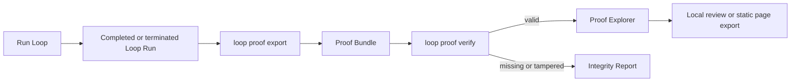
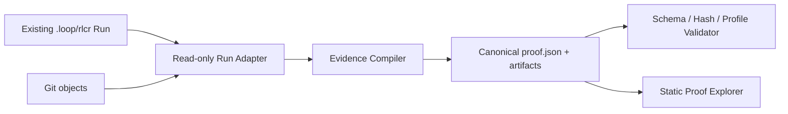

# Proof of Loop: Next-Stage MVP Product Design

> Version: Draft v0.1
> Date: 2026-07-24
> Baseline: the current Loop `0.1.0` Plan, Acceptance Criteria, Goal Tracker, Round Contract, Stop Hook, Codex Review, BitLesson, and the `.loop/rlcr/` round artifacts.
> This stage excludes Git platform partnerships, a bounty market, payments, tokens, DIDs, and on-chain settlement.

> **Status note**: this draft is revised section by section by [`proof-of-loop-mvp-decisions.md`](proof-of-loop-mvp-decisions.md) (D1-D17); where the two differ, the decision appendix governs. The implementable specification derived from both is [`proof-of-loop-mvp-spec.md`](proof-of-loop-mvp-spec.md).

## 1. Product Decision

The next-stage MVP should be positioned as:

> **Proof of Loop is Loop's local evidence compiler, validator, and visual browser. It turns one AI coding run into a portable, inspectable, replayable Proof Bundle.**

The recommended first product form is a **local-first Proof Explorer**, not a protocol, a market, or a cloud collaboration platform.

The reason: Loop can already execute and review, but its value is mostly hidden inside the Markdown, state files, and logs under `.loop/rlcr/<timestamp>/`. The shortest product loop available today is letting a maintainer answer, within a few minutes:

1. What did this delivery originally promise?
2. Is each AC satisfied, and where is the evidence?
3. What problems, fixes, and state transitions happened along the way?
4. Which commit did the final review target, and are there unresolved findings?
5. Is this evidence complete, has it been modified, and what has been withheld?

## 2. Target Users and Core Task

### 2.1 Primary users

- individual developers completing public-repository tasks with Claude, Codex, or another agent;
- open-source maintainers reviewing agent-generated PRs;
- small engineering teams wanting to assess the quality of an AI coding process.

### 2.2 Core user task

> When an agent claims a task is done, I need to judge quickly what it actually completed, on what basis, whether the review is credible, and what I still need to inspect by hand.

### 2.3 Users the MVP does not serve

- teams needing hosted private code or enterprise SSO;
- task markets needing automatic payment, staking, or arbitration;
- high-risk software needing formal verification or security certification;
- cross-organization real-time reviewer networks.

## 3. Mapping Existing Loop Artifacts to Product Capabilities

| Current Loop artifact / capability | Meaning in Proof of Loop | Current gap |
|---|---|---|
| `plan.md` and plan backup | Source of the fixed delivery goal and ACs | No stable, machine-readable spec expression |
| `state.md` / `*-state.md` | Run configuration, phase, and final state | Markdown frontmatter is not a public data contract |
| `goal-tracker.md` | Evolution record of ACs, tasks, and deferrals | ACs and evidence references lack stable IDs |
| `round-N-contract.md` | Each round's mainline objective and boundaries | No structured mainline progress record |
| `round-N-summary.md` | The Builder's claims about the round's work | Self-report and verifiable fact are not explicitly separated |
| `round-N-review-result.md` | Reviewer findings and phase conclusions | Most results are still natural language and markers |
| Git commit / base commit | Code version boundary | No unified commit evidence manifest |
| Test commands and output | Deterministic verification evidence | Environment, exit codes, and output summaries are not standardized |
| BitLesson Delta | Project experience evolution | Not suitable for publication by default; needs its own privacy policy |
| Stop Hook state transitions | Replayable control trace | No explicit transition event stream |
| `loop monitor` | Observing state during a run | Cannot be used for post-completion evidence review and sharing |

Conclusion: the MVP does not need to rewrite Loop's execution engine; it needs to add a stable "evidence product layer" on top of it.

Implementation basis: sessions and initial artifacts are created by [`setup-rlcr-loop.sh`](../scripts/setup-rlcr-loop.sh); exit gating and phase transitions are centralized in [`loop-codex-stop-hook.sh`](../hooks/loop-codex-stop-hook.sh); state fields and terminal-state semantics are centralized in [`loop-common.sh`](../hooks/lib/loop-common.sh); the existing [`loop.sh`](../scripts/loop.sh) already provides a unified command entry point and run monitoring. Detailed code research is in [`repository-research.md`](repository-research.md).

## 4. MVP User Flow



Recommended command experience:

```bash
loop proof export --latest --profile public
loop proof verify .loop/proofs/<proof-id>/proof.json
loop proof open .loop/proofs/<proof-id>/proof.json
```

### 4.1 First-run experience

1. the user runs RLCR as they do today;
2. the Run reaches a `complete`, `stop`, `cancel`, `maxiter`, or `unexpected` terminal state;
3. `export` reads the Run, Git, and review artifacts read-only;
4. a content-addressed Proof Bundle is generated;
5. `verify` checks schema, hashes, references, and required evidence;
6. `open` validates the Bundle and its bound renderer, then opens the offline Proof Explorer in a browser;
7. the user inspects the AC matrix, round timeline, finding-to-fix chains, and integrity report.

`complete` is not a precondition for export. Failed, cancelled, and stalled Runs have retrospective value too, and must also be able to produce a Proof Bundle.

## 5. Product Information Architecture

The Explorer MVP needs only one Proof detail page — no account system, no complex navigation.

### 5.1 Overview

- Proof ID, repository, base/head commit;
- Run terminal state and Delivery Verdict;
- Proof Integrity status;
- the Verification Profile used;
- round count, duration, commit count, test count, finding count;
- an explicit disclaimer: the conclusion covers only the fixed ACs, commit, and verification policy.

### 5.2 Acceptance Matrix

Each AC shows:

- status: `met | partial | unmet | unverifiable`;
- supporting and contradicting evidence;
- associated tests, commits, findings;
- reviewer rationale;
- whether manual confirmation is needed.

### 5.3 Run Timeline

- Setup, each Round, Review Phase, Finalize, and the terminal state;
- each round's mainline verdict: `advanced | stalled | regressed`;
- plan evolution, replans, and circuit breakers;
- key commit, test, and finding events.

### 5.4 Findings

- severity, status, round discovered;
- affected ACs and files;
- raw evidence;
- fix commit and re-review result;
- the `resolved | open | waived | unverifiable` lifecycle.

### 5.5 Evidence & Integrity

- Bundle files, hashes, and sizes;
- schema validation, reference integrity, and hash checks;
- missing, unparseable, and redacted evidence;
- exporter, Loop, Reviewer, and profile versions.

## 6. Core Domain Objects

The MVP uses a single `ProofBundle` aggregate root containing these logical objects:

```text
ProofBundle
├── source          repository, base/head commit, Loop version
├── specification   goal, ACs, scope, verification policy
├── run             configuration, rounds, state transitions, terminal state
├── evidence[]      commit, test, review, summary, artifact
├── findings[]      findings and their fix lifecycle
├── verdict         per-AC verdict and overall decision
├── integrity       schema, hash, reference, completeness results
└── disclosure      redaction profile and withheld-field declaration
```

Points to settle in follow-up schema work:

- every object uses a stable ID;
- every reference goes through an ID or a relative content-addressed path;
- `proof_id` is computed from the canonical payload; transport metadata such as export time must not change it;
- raw Markdown may be retained as an Evidence Item, but must not continue to serve as the only protocol;
- model chains of thought are not stored; the default public bundle excludes full prompts, transcripts, absolute local paths, and BitLesson body text.

## 7. State Semantics: Integrity and Delivery Conclusion Must Stay Separate

This is the MVP's most important product constraint.

### 7.1 Proof Integrity

| State | Meaning |
|---|---|
| `valid` | schema, hashes, references, and the evidence the profile requires all pass |
| `incomplete` | the Bundle is readable but lacks evidence the profile requires |
| `invalid` | the schema, a hash, or a reference conflicts or has been tampered with |

### 7.2 Delivery Verdict

| State | Meaning |
|---|---|
| `accept` | every required AC is `met` and there are no blocking findings |
| `changes_required` | fixable `partial`/`unmet` statuses or open findings exist |
| `reject` | the delivery clearly fails the goal or violates a fixed boundary |
| `unverifiable` | key evidence is insufficient for a reliable judgment |

### 7.3 Loop-Verified Badge

Shown only when all of the following hold:

- Proof Integrity is `valid`;
- Delivery Verdict is `accept`;
- the reviewed commit matches the Bundle's head commit;
- the Verification Profile used is explicit and version-pinned;
- the UI simultaneously displays the coverage scope and avoids any phrasing like "the code has been absolutely proven correct".

Example:

```text
Loop-Verified · public-v0 · 8/8 AC met · reviewed at 8f31c2a
```

## 8. MVP Feature Scope

### P0: must ship

#### A. Evidence Compiler

- discover and select a Loop Run;
- read current and historical `0.1.x` artifacts;
- compile Plan, state, tracker, round, review, and Git information into a canonical manifest;
- compute SHA-256 for each Evidence Item;
- emit parse warnings rather than silently discarding unknown fields;
- support the `local` and default `public` disclosure profiles.

#### B. Proof Validator

- JSON Schema validation;
- hash and cross-reference validation;
- Verification Profile required-evidence validation;
- detect a mismatch between reviewed commit and head commit;
- emit machine-readable JSON and a human-readable summary;
- use stable exit codes on validation failure.

#### C. Proof Explorer

- opens offline, no login;
- shows Overview, AC Matrix, Timeline, Findings, Integrity;
- supports jumping straight to a raw Evidence Item;
- clearly distinguishes missing, redacted, and unparseable evidence;
- generates a single-directory static site, easy to share as a CI artifact.

#### D. Loop CLI integration

- add `proof export|verify|open` under the existing `loop` command;
- the exporter is read-only and does not modify the source Run;
- support `--latest` and an explicit Run path;
- error messages point at specific files and suggest fixes.

### P1: immediately after the MVP

- a GitHub Actions artifact example;
- a PR Markdown summary and badge;
- two Verification Profiles: `public-v0`, `local-v0`;
- a local index page for multiple Proofs;
- a structured test result sidecar;
- a structured Reviewer verdict sidecar, to reduce natural-language parsing.

### Explicitly not doing

- cloud accounts, databases, and organization spaces;
- bounties, payments, staking, tokens, challenges, or arbitration;
- wallets, DIDs, and third-party identity systems;
- private repository uploads;
- multi-reviewer quorum;
- automatic PR merging;
- claiming AI review as a mathematical proof or a security certification.

## 9. Recommended Technical Architecture



### 9.1 Boundary principles

- do not rewrite the existing RLCR state machine; the Proof layer only consumes artifacts already produced;
- `proof.json` is the only stable interface between Compiler, Validator, and Explorer;
- the UI never parses historical Markdown directly; compatibility logic exists only in the Run Adapter;
- the Validator never calls an LLM, guaranteeing the same input yields the same integrity result;
- the Delivery Verdict may come from existing Reviewer results, but the extraction method and its uncertainty must be recorded.

### 9.2 MVP technology choices

To fit the current Bash-centric repository with no Node build dependency, the recommendation is:

- Run Adapter / Compiler / Validator: the Python standard library;
- data contract: JSON Schema;
- CLI entry: the existing `scripts/loop.sh`;
- Explorer: native static HTML/CSS/JavaScript;
- packaging: a single-directory offline artifact with no backend service.

This keeps the MVP free of resident services and account systems, and lets a fuller web frontend replace the Explorer later without changing `proof.json`.

### 9.3 Suggested layout

```text
proof/
├── schema/
│   ├── proof-bundle-v0.schema.json
│   └── verification-profile-v0.schema.json
├── profiles/
│   ├── public-v0.json
│   └── local-v0.json
└── explorer/
    ├── index.html
    ├── app.js
    └── styles.css
scripts/
├── proof-export.py
├── proof-verify.py
└── proof-open.py
tests/
├── test-proof-export.sh
├── test-proof-verify.sh
└── fixtures/proof/
```

## 10. MVP Acceptance Criteria

- **AC-1 Run compatibility**: can export `complete`, `stop`, `cancel`, `maxiter`, and `unexpected` Runs produced by the current version.
- **AC-2 Stable identity**: re-exporting the same Run with the same disclosure profile yields the same canonical payload hash and `proof_id`.
- **AC-3 Tamper detection**: after modifying the manifest or any non-redacted Evidence Item, the Validator returns `invalid` and names the target.
- **AC-4 AC traceability**: every AC has a status, a rationale, and zero or more supporting/contradicting evidence references; zero evidence must never be auto-marked `met`.
- **AC-5 Finding lifecycle**: the Explorer can show a finding's discovery, fix commit, and re-review result; when it cannot be linked, it is marked `unverifiable`.
- **AC-6 Privacy by default**: `public-v0` contains no full prompts, transcripts, absolute paths, environment secrets, or BitLesson body text, and lists a redaction declaration.
- **AC-7 Offline review**: after unpacking the static artifact, all public evidence is viewable with no network and no login.
- **AC-8 Read-only export**: the export process does not modify the source Run, Git index, working tree, or commit history.
- **AC-9 Honest status**: Proof Integrity, Run terminal state, and Delivery Verdict stay independent in both data and UI.
- **AC-10 Actionable failure**: missing files, legacy formats, and parse failures each produce a specific warning or error; never a crash, never a silent pass.

## 11. Non-functional Requirements

- a default exported Bundle is under 10 MB; large logs keep only a summary and an external artifact reference;
- within 1,000 Evidence Items, export and validation each complete within 5 seconds;
- canonicalization, hashing, and profile behavior have fixed test vectors;
- CI on both Linux and macOS; cover the system Bash 3.2 environment specifically or require a newer Bash explicitly;
- every public field needs a schema description; unknown fields are handled by the schema version policy;
- never read `.env`, credential directories, or files the Run does not explicitly reference.

## 12. Milestones and Priorities

### Milestone 0: freeze semantics and samples (2-3 days)

- confirm the terminology and state semantics in this document;
- select 3 real Runs: success, review rework, stop/failure;
- hand-build the expected `proof.json` golden examples;
- freeze the `public-v0` minimum evidence requirements.

### Milestone 1: Evidence Contract (4-5 days)

- complete the Proof Bundle and Verification Profile JSON Schemas;
- define canonicalization and the `proof_id` algorithm;
- establish schema, hash, and redaction test vectors.

### Milestone 2: Compiler + Validator (5-7 days)

- implement the Run Adapter, Evidence Compiler, and Validator;
- support all current terminal states and warn on historical missing fields;
- wire up `loop proof export|verify`;
- complete tamper, privacy, determinism, and read-only tests.

### Milestone 3: Proof Explorer (5-7 days)

- implement the five core views;
- support single-directory static export and `loop proof open`;
- design an explicit visual language for missing/redacted/unverifiable states;
- take screenshots and walk through manually with the three golden Runs.

### Milestone 4: public dogfood (1 week)

- use it on 5-10 public open-source tasks;
- collect maintainer comprehension time, manual overrides, and evidence gaps;
- revise the `public-v0` profile and the schema;
- publish the first Loop-Verified example page.

Estimate: roughly 4-5 weeks for one developer to reach a publicly usable MVP; two people can do it in about 3 weeks, but schema and data semantics should not be compressed by parallel rushing.

## 13. Success Metrics

### North star

> **Maintainer time-to-trust: the median time a maintainer needs, from opening a Proof to being able to decide "accept", "request changes", or "cannot tell".**

### MVP metrics

- proof export success rate;
- required evidence completeness rate;
- AC evidence coverage rate;
- finding-to-fix linkage rate;
- third-party proof verification success rate;
- maintainer decision time;
- manual override rate;
- `unverifiable` AC rate;
- public-profile secret leakage incidents, target 0;
- the share of export failures caused by legacy formats, missing files, and parse ambiguity.

Agent lines of code, round count, model call volume, and badge count are not the north star.

## 14. Main Risks and Handling

| Risk | Impact | MVP handling |
|---|---|---|
| Review is mostly natural language | Verdict and finding parsing may be unstable | Keep the raw text, record parser confidence; mark `unverifiable` when uncertain; add structured sidecars in P1 |
| Historical Runs have no stable object IDs | Cross-references may be ambiguous | Derive IDs from source path and content hash, and emit a compatibility warning |
| "Proof" is read as absolute correctness | The product creates false confidence | Force display of profile, ACs, commit, and disclaimer; keep integrity and verdict separate |
| A public bundle leaks prompts or paths | Blocks real-world use | `public-v0` discloses the minimum by default; secret/path scanning; explicit redaction report |
| Raw logs are too large | The Bundle becomes hard to share | Content-addressed artifacts, summaries, a size budget, and external references |
| The exporter disturbs an active Run | Breaks the existing state machine | Allow terminal states only by default; explicit snapshot mode later; all reads are read-only |
| A new UI couples backwards onto old Markdown | Later evolution becomes hard | The UI reads only the canonical schema; compatibility parsing is centralized in the Adapter |
| macOS shell differences | Inconsistent CLI installation and testing | Use Python for the new core; add macOS or a Bash version matrix to CI |

## 15. Recommended Product Roadmap

### Now: Proof of Loop MVP

- Proof Bundle v0;
- `loop proof export|verify|open`;
- `public-v0` / `local-v0`;
- a single-Proof offline Explorer;
- dogfood on 5-10 public tasks.

### Next: collaboration and distribution

- CI artifacts and PR summaries;
- a local index for multiple Proofs;
- structured test and Reviewer sidecars;
- optional manual acknowledgment;
- hosted static Proof pages, still without uploading private source code.

### Later: an open verification layer

- independent Reviewer import;
- a Challenge object;
- cross-runtime, cross-Git-host adapters;
- signing, identity, payment, and settlement capabilities;
- a private, self-hosted, or encrypted Evidence Store.

Later is not a commitment for this stage; it only ensures the MVP data contract does not foreclose future extension.

## 16. Product Decisions Needing Confirmation

This design already adopts the following recommended defaults and can proceed straight to schema and implementation planning:

1. **product boundary**: Proof of Loop is an evidence product layer above Loop; it does not replace Loop;
2. **primary users**: public-repository maintainers and AI coding developers;
3. **distribution**: locally generated, offline-viewable, shareable as a static artifact;
4. **trust semantics**: validating integrity is separate from assessing delivery;
5. **technical boundary**: no backend, no accounts, no payments, no identity dependency;
6. **implementation location**: same repository as Loop first, splitting reconsidered once the data contract is stable.

If only one direction is to be confirmed, confirm this one: **does the MVP accept "local-first + static sharing" rather than a hosted web SaaS in version one?**
