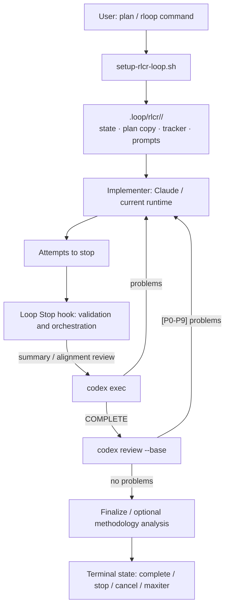

# Loop Repository Research Report

> Research scope: this repository's source, documentation, tests, and CI configuration only; no external material relied on.
> Research date: 2026-07-23; repository version identifier is `0.1.0`.

## One-line Overview

Loop is a workflow plugin / skill pack for AI-assisted development, not a business application or a general-purpose SDK. It separates the "implementer" from the "independent reviewer": Claude Code implements according to a plan, and Codex reviews at the end of each round, repeatedly blocking exit, reporting problems, and forcing re-implementation until both plan acceptance and final code review pass. The project calls this process RLCR (Ralph-Loop with Codex Review).

Evidence: [`README.md:5-51`](../README.md), [`.claude-plugin/plugin.json:1-18`](../.claude-plugin/plugin.json).

Its primary delivery forms are:

- Claude Code plugin commands (`/rloop:*`);
- skills and runtime packages installable into Codex and Kimi;
- a set of Bash hooks, Markdown prompt templates, and a filesystem state machine stored under the target project's `.loop/`.

Evidence: [`README.md:53-72`](../README.md), [`scripts/install-skill.sh:1-44`](../scripts/install-skill.sh), [`scripts/install-skill.sh:155-250`](../scripts/install-skill.sh).

## Project Positioning and Usage Boundaries

### The problem it solves

The project targets the problem of "an AI first draft that looks finished but actually has omissions, drifts from the plan, or introduces regressions". Instead of treating one model response as done, it uses a two-layer review loop:

1. Implementation phase: Codex reviews Claude's summary for the round, the original plan, the goal tracker, and recent commit history; only when the last non-empty line of output is exactly `COMPLETE` does it advance to the next phase.
2. Code review phase: run `codex review --base <base>`; any `[P0]`-`[P9]` problem found generates a fix round; only when no such problems remain does it enter the wrap-up phase.

Evidence: [`README.md:19-51`](../README.md), [`hooks/loop-codex-stop-hook.sh:1000-1125`](../hooks/loop-codex-stop-hook.sh), [`hooks/loop-codex-stop-hook.sh:1217-1329`](../hooks/loop-codex-stop-hook.sh).

### Prerequisites and runtime

The Claude Code plugin path requires the Codex CLI, `jq`, and Git; the Gemini CLI is only an optional one-shot deep-research capability. The Codex installation path requires a Codex with native hook support (the installation docs give `0.114.0` as the minimum version).

Evidence: [`docs/install-for-claude.md:1-31`](install-for-claude.md), [`scripts/setup-rlcr-loop.sh:326-363`](../scripts/setup-rlcr-loop.sh), [`docs/install-for-codex.md:1-30`](install-for-codex.md).

The repository's current remote origin is `ProofofShip/loop`, but the installation examples and metadata in the README and plugin manifest still reference `FrankDan77/loop`. From the repository contents this looks like a migration or historical branding remnant; the current code alone cannot determine whether it is intentional.

Evidence: [`README.md:61-68`](../README.md), [`.claude-plugin/plugin.json:6-9`](../.claude-plugin/plugin.json).

## Overall Design

### Control plane and data plane

This repository's design can be understood as "a hook-driven file state machine". The control plane decides when an agent is allowed to exit or blocked from exiting; the data plane is the plan backup, state, round summaries, review results, goal tracker, and wrap-up records under `.loop/rlcr/<timestamp>/` inside the target project.

Evidence: [`skills/loop/SKILL.md:32-48`](../skills/loop/SKILL.md), [`skills/loop/SKILL.md:180-203`](../skills/loop/SKILL.md), [`hooks/loop-codex-stop-hook.sh:1-12`](../hooks/loop-codex-stop-hook.sh).

### Layered structure

| Layer | Main directories / files | Responsibility |
|---|---|---|
| Plugin and entry points | `.claude-plugin/`, `commands/`, `skills/` | Declare the Claude plugin; provide entry points for plan generation, plan refinement, RLCR, and one-shot consultation. |
| Workflow initialization | `scripts/setup-rlcr-loop.sh` | Parse arguments, validate Git/plan/dependencies, choose the baseline, create session state and the first round's prompt. |
| Lifecycle control | `hooks/hooks.json`, `hooks/loop-codex-stop-hook.sh` | Register pre-checks for Read/Write/Edit/Bash, post-processing for Bash, and the Stop hook as the main controller. |
| Reusable infrastructure | `hooks/lib/`, `scripts/lib/` | Project root resolution, state read/write, template rendering, config merging, model routing, background tasks, and monitoring utilities. |
| Behavioral contracts | `prompt-template/`, `agents/`, `templates/` | Express review rules, anti-drift rules, plan format, and BitLesson format as replaceable Markdown contracts. |
| Runtime support | `scripts/install-*.sh`, `scripts/loop.sh` | Install into different runtimes, merge Codex hooks, inject runtime paths, provide terminal monitoring. |
| Quality assurance | `tests/`, `.github/workflows/` | Shell unit/integration/robustness tests plus CI syntax and full-suite runs. |

Evidence: [`hooks/hooks.json:1-75`](../hooks/hooks.json), [`scripts/install-skill.sh:155-250`](../scripts/install-skill.sh), [`scripts/loop.sh:1190-1246`](../scripts/loop.sh), [`tests/run-all-tests.sh:59-119`](../tests/run-all-tests.sh).

## Main Execution Flow

### 1. Plan pre-check and session creation

The `start-rlcr-loop` command first requires a plan relevance / branch compliance pre-check and a "plan comprehension quiz"; the latter is advisory friction rather than an unbypassable authorization gate. The setup script handles argument parsing, dependency checks, allowing only one active loop, requiring a clean working tree, baseline branch priority resolution, and freezing the base commit SHA at startup.

Evidence: [`commands/start-rlcr-loop.md:13-100`](../commands/start-rlcr-loop.md), [`scripts/setup-rlcr-loop.sh:91-184`](../scripts/setup-rlcr-loop.sh), [`scripts/setup-rlcr-loop.sh:365-397`](../scripts/setup-rlcr-loop.sh), [`scripts/setup-rlcr-loop.sh:718-815`](../scripts/setup-rlcr-loop.sh).

The point of freezing the commit is that even if the user commits on the baseline branch itself, review still compares against "the baseline at startup" rather than a continually advancing branch reference.

Evidence: [`scripts/setup-rlcr-loop.sh:807-815`](../scripts/setup-rlcr-loop.sh).

### 2. Persistent state and the first round contract

Setup backs up the plan under `.loop/rlcr/<timestamp>/`, initializes the BitLesson knowledge base, and writes `state.md` YAML frontmatter. The state covers round count, model, reasoning effort, timeout, baseline, phase, session ID, whether to push, privacy mode, anti-drift counters, and more. It also generates `goal-tracker.md`, the round summary template, the round contract, and the implementation prompt.

Evidence: [`scripts/setup-rlcr-loop.sh:821-923`](../scripts/setup-rlcr-loop.sh), [`scripts/setup-rlcr-loop.sh:1158-1201`](../scripts/setup-rlcr-loop.sh).

The Goal Tracker uses immutable/mutable partitions: the goal and acceptance criteria are fixed in Round 0; active tasks, verified completions, deferrals, plan evolution, blocking issues, and queued issues update continuously. Each round also has its own Round Contract, restricting the round to one mainline objective, 1-2 ACs, genuine blockers, queued items, and success conditions.

Evidence: [`scripts/setup-rlcr-loop.sh:1062-1154`](../scripts/setup-rlcr-loop.sh), [`scripts/setup-rlcr-loop.sh:1293-1343`](../scripts/setup-rlcr-loop.sh), [`prompt-template/claude/next-round-prompt.md:12-45`](../prompt-template/claude/next-round-prompt.md).

### 3. Implementation phase: summary review and anti-drift

The agent finishes the round's work, commits changes, writes a summary, and stops normally; the Stop hook then takes over the exit. It first checks state schema, session, branch, plan backup/consistency, unfinished tasks, Git cleanliness, unpushed commits (optional), the summary, the Round Contract, and the BitLesson Delta; most anomalies are fail-closed, meaning exit is blocked rather than allowed.

Evidence: [`hooks/loop-codex-stop-hook.sh:61-102`](../hooks/loop-codex-stop-hook.sh), [`hooks/loop-codex-stop-hook.sh:285-457`](../hooks/loop-codex-stop-hook.sh), [`hooks/loop-codex-stop-hook.sh:666-876`](../hooks/loop-codex-stop-hook.sh).

Once past the gates, the hook uses `codex exec` to run either a regular review or a Full Alignment Check every N rounds. The review prompt requires comparing against the original plan, the summary, the goal tracker, and recent commits, classifying mainline gaps, blocking side issues, and queued side issues, and emitting `Mainline Progress Verdict: ADVANCED / STALLED / REGRESSED`.

Evidence: [`hooks/loop-codex-stop-hook.sh:1000-1125`](../hooks/loop-codex-stop-hook.sh), [`prompt-template/codex/regular-review.md:22-75`](../prompt-template/codex/regular-review.md), [`prompt-template/codex/full-alignment-review.md:21-114`](../prompt-template/codex/full-alignment-review.md).

Two consecutive `STALLED`/`REGRESSED` rounds force a replan in the next round; three consecutive rounds trip the mainline drift circuit breaker and stop. A Full Alignment Check can also end with a strict `STOP`, avoiding an infinite loop on repeated problems.

Evidence: [`hooks/loop-codex-stop-hook.sh:1433-1504`](../hooks/loop-codex-stop-hook.sh), [`hooks/loop-codex-stop-hook.sh:1829-1874`](../hooks/loop-codex-stop-hook.sh), [`hooks/loop-codex-stop-hook.sh:1959-1995`](../hooks/loop-codex-stop-hook.sh).

### 4. Code review, wrap-up, and terminal state

Only when the last non-empty line of the implementation review is exactly `COMPLETE`, and the maximum round count has not been exceeded, does the system write `review_started` into the state and create the `.review-phase-started` marker. The hook then runs `codex review --base` against the baseline recorded at startup; any `[P0-P9]` generates the next round's fix prompt, and a failed review command or empty output likewise blocks exit. When no problems remain, `state.md` is renamed to `finalize-state.md`; once wrap-up finishes it becomes `complete-state.md`.

Evidence: [`hooks/loop-codex-stop-hook.sh:1217-1329`](../hooks/loop-codex-stop-hook.sh), [`hooks/loop-codex-stop-hook.sh:1508-1671`](../hooks/loop-codex-stop-hook.sh), [`hooks/loop-codex-stop-hook.sh:1876-1957`](../hooks/loop-codex-stop-hook.sh), [`hooks/loop-codex-stop-hook.sh:975-991`](../hooks/loop-codex-stop-hook.sh).

By default it also enters a "methodology analysis" phase at the exit point, requiring a redacted process-improvement report and a completion marker; `--privacy` disables that phase.

Evidence: [`scripts/setup-rlcr-loop.sh:135-140`](../scripts/setup-rlcr-loop.sh), [`hooks/lib/methodology-analysis.sh:38-206`](../hooks/lib/methodology-analysis.sh), [`prompt-template/claude/methodology-analysis-prompt.md:1-73`](../prompt-template/claude/methodology-analysis-prompt.md).

## Core Subsystems

### Hooks and safety guardrails

`hooks/hooks.json` registers validators into Claude's `UserPromptSubmit`, `PreToolUse`, `PostToolUse`, and `Stop` lifecycle points. The shared library checks the hook JSON input for NUL bytes, invalid UTF-8, non-JSON content, missing fields, and excessive nesting, and locates the corresponding active loop by session ID.

Evidence: [`hooks/hooks.json:4-75`](../hooks/hooks.json), [`hooks/lib/loop-common.sh:91-165`](../hooks/lib/loop-common.sh), [`hooks/lib/loop-common.sh:332-429`](../hooks/lib/loop-common.sh).

The Write, Edit, and Bash validators do not let the agent tamper with state files, write into historical rounds or wrong paths, bypass prompt files, manipulate todo files arbitrarily, or add local `.loop/` runtime state to Git. The Stop hook additionally rejects uncommitted work and changed files exceeding 2,000 lines.

Evidence: [`hooks/lib/loop-common.sh:843-919`](../hooks/lib/loop-common.sh), [`hooks/lib/loop-common.sh:1262-1469`](../hooks/lib/loop-common.sh), [`hooks/loop-codex-stop-hook.sh:518-604`](../hooks/loop-codex-stop-hook.sh).

One implementation boundary deserves attention: validator comments state explicitly that agents spawned across sessions do not share the current hook constraints. So these guardrails are strong runtime constraints, but not OS-level enforced isolation.

Evidence: [`hooks/loop-write-validator.sh:82-85`](../hooks/loop-write-validator.sh), [`hooks/loop-bash-validator.sh:68-75`](../hooks/loop-bash-validator.sh).

### Templates and prompt contracts

Templates pull system behavior out of the Bash controller. `prompt-template/block/` holds unified blocking messages, `codex/` holds the summary / full-alignment / code review prompts, `claude/` holds the next-round, fix, wrap-up, and team collaboration prompts, and `plan/` holds the plan workflow templates. The template loader supports both safe substitution and an in-script fallback when a template is missing.

Evidence: [`prompt-template/`](../prompt-template), [`hooks/lib/template-loader.sh:48-135`](../hooks/lib/template-loader.sh), [`hooks/lib/template-loader.sh:185-237`](../hooks/lib/template-loader.sh).

The benefit of this design is customizability, testability, and compatibility with older runtimes; the cost is that system semantics are spread across scripts, templates, and generated state files, so any change must examine all three together.

Evidence: [`tests/test-template-references.sh`](../tests/test-template-references.sh), [`tests/test-templates-comprehensive.sh`](../tests/test-templates-comprehensive.sh).

### BitLesson: project-level experience memory

Each project's `.loop/bitlesson.md` records failure modes, root causes, solutions, constraints, and verification evidence in a strict entry format. Every task/subtask first calls the selector to choose relevant lessons; every round summary must carry a `BitLesson Delta`, and the Stop hook validates its consistency.

Evidence: [`templates/bitlesson.md:1-23`](../templates/bitlesson.md), [`docs/bitlesson.md:25-51`](bitlesson.md), [`hooks/loop-codex-stop-hook.sh:857-876`](../hooks/loop-codex-stop-hook.sh).

The selector routes `gpt-*`/`o*` to Codex and the Claude family to Claude based on model name, with fallbacks in Codex-only mode or when the chosen provider is unavailable. Its Codex invocation uses a read-only sandbox, low reasoning effort, and forces exactly two lines of stable output format.

Evidence: [`scripts/lib/model-router.sh:10-90`](../scripts/lib/model-router.sh), [`scripts/bitlesson-select.sh:111-131`](../scripts/bitlesson-select.sh), [`scripts/bitlesson-select.sh:148-266`](../scripts/bitlesson-select.sh).

### Configuration, installation, and observability

Configuration merges in the order "plugin defaults → user XDG config → project `.loop/config.json` (or `LOOP_CONFIG`) → CLI arguments". The default Codex model is `gpt-5.5` with `high` effort, and Agent Teams, optional plan language, and plan generation mode are supported.

Evidence: [`docs/usage.md:256-307`](usage.md), [`config/default_config.json:1-8`](../config/default_config.json), [`scripts/lib/config-loader.sh:63-137`](../scripts/lib/config-loader.sh).

The installer synchronizes four skills, scripts, hooks, templates, config, and agents, then materializes `{{LOOP_RUNTIME_ROOT}}`; the Codex installer merges the managed Stop hook, preserves unrelated hooks, and stays compatible with both the `hooks` and legacy `codex_hooks` feature names. `loop monitor` reads `.loop` state and cached logs to show round count, model, Git status, and a Goal Tracker overview.

Evidence: [`scripts/install-skill.sh:155-250`](../scripts/install-skill.sh), [`scripts/install-codex-hooks.sh:78-223`](../scripts/install-codex-hooks.sh), [`scripts/loop.sh:1190-1246`](../scripts/loop.sh).

The one-shot `ask-codex` and `ask-gemini` also save inputs, outputs, metadata, and debug caches. Codex uses `--full-auto` by default; only explicitly setting `LOOP_CODEX_BYPASS_SANDBOX=true|1` uses the dangerous sandbox/approval bypass mode.

Evidence: [`scripts/ask-codex.sh:199-298`](../scripts/ask-codex.sh), [`scripts/ask-gemini.sh:1-19`](../scripts/ask-gemini.sh), [`docs/usage.md:329-380`](usage.md).

## Quality Assurance and Local Verification

### Test design

The main test entry point lists 53 shell suites, parallelized by CPU count by default (up to 8), each suite using an isolated temporary directory; if a real Codex is absent, the runner also creates a mock. Coverage includes templates, validators, the Stop gate, state transitions, plan/path handling, sessions, Agent Teams, configuration, installation, model routing, monitoring, plus robustness scenarios for state, Git, input, concurrency, and timeouts.

Evidence: [`tests/run-all-tests.sh:1-44`](../tests/run-all-tests.sh), [`tests/run-all-tests.sh:59-141`](../tests/run-all-tests.sh), [`tests/run-all-tests.sh:162-303`](../tests/run-all-tests.sh).

GitHub Actions installs `zsh` and `jq` and runs the full suite on push and PR; there are also full-script Bash/Zsh syntax checks, template-specific checks, and branch target restrictions.

Evidence: [`.github/workflows/run-all-tests.yml:1-22`](../.github/workflows/run-all-tests.yml), [`.github/workflows/shell-syntax-check.yml:1-61`](../.github/workflows/shell-syntax-check.yml), [`.github/workflows/template-test.yml:1-61`](../.github/workflows/template-test.yml).

### Local results (2026-07-23)

- Targeted suites that passed: `test-template-loader.sh`, `test-config-merge.sh`, `test-model-router.sh`, `test-state-exit-naming.sh`, `test-stop-gate.sh`, `test-codex-hook-install.sh`.
- The full runner could not start any tests on this macOS system Bash `3.2.57`: `tests/run-all-tests.sh` uses `declare -A` (Bash 4+) and depends on the nanosecond format of `date +%s%3N`, causing associative-array and time-parsing failures respectively. This does not mean the individual suites fail; the runner is incompatible with the current environment at the scheduling stage.

Related implementation evidence: [`tests/run-all-tests.sh:162-218`](../tests/run-all-tests.sh), [`tests/run-all-tests.sh:154-160`](../tests/run-all-tests.sh). CI uses Ubuntu, so this macOS Bash 3.2 difference is not exposed in its default matrix.

## The Project's Distinctive Features

1. **Independent review rather than model self-assessment.** Claude implements, Codex reviews, and it reviews "is the plan complete" before "does the Git diff contain defects". This is the project's core differentiator.
2. **Files as the audit trail.** The plan backup, state, round summaries, review results, command debug records, and terminal-state renames together form an inspectable session history rather than something hidden inside a single process's memory.
3. **Heavy anti-goal-drift machinery.** Immutable ACs, the Goal Tracker, the Round Contract, the mainline/blocking/queued split, periodic Full Alignment, and the consecutive-stall circuit breaker jointly constrain the classic agent behavior of "clear the small problems first, forget the goal later".
4. **Execution guardrails that block fake completion.** Exit is gated by multiple checks over tasks, Git, plan integrity, the summary, state consistency, and code review output; a failed or empty code review cannot be skipped silently either.
5. **Experience distillation built into the process.** BitLesson is not an ordinary log: it is selected before each task and delta-validated at the end of each round, forming a reusable in-project experience base.
6. **Runtime adaptation first.** The project simultaneously maintains the Claude plugin, Codex native hooks, and Kimi/Codex skill installation paths, with compatibility handling for Codex feature-name changes and nested hook recursion.

Primary evidence for these features: [`README.md:19-51`](../README.md), [`hooks/loop-codex-stop-hook.sh:1673-2233`](../hooks/loop-codex-stop-hook.sh), [`scripts/setup-rlcr-loop.sh:1062-1154`](../scripts/setup-rlcr-loop.sh), [`docs/bitlesson.md:25-51`](bitlesson.md), [`scripts/install-skill.sh:382-390`](../scripts/install-skill.sh).

## Risks to Watch When Maintaining

- The core controller is large: the Stop hook is about 2,233 lines and the shared library about 1,582 lines; together they are a highly coupled center for the state machine, lifecycle, Git checks, and safety rules. Any change to a field, terminal-state name, or prompt protocol should be reviewed against setup, hook, templates, and tests simultaneously.
- The logic depends heavily on Bash, regular expressions, textual frontmatter, and CLI output markers; this improves portability and auditability, but makes shell version differences, paths/quoting/encoding, and output formats the main failure surface.
- `.loop/` state must stay local and out of Git. The system actively blocks tracking it, but if a user manually corrupts the state or bypasses the runtime, the recovery path is usually to cancel and restart the session.
- Capability depends on the installed Claude/Codex CLI features and configuration. Native hooks, `--disable`, sandbox arguments, and model availability in particular all have version-dependent compatibility code.

Evidence: [`hooks/loop-codex-stop-hook.sh:1-15`](../hooks/loop-codex-stop-hook.sh), [`hooks/lib/loop-common.sh:1422-1469`](../hooks/lib/loop-common.sh), [`scripts/install-codex-hooks.sh:78-103`](../scripts/install-codex-hooks.sh), [`hooks/loop-codex-stop-hook.sh:1169-1205`](../hooks/loop-codex-stop-hook.sh).

## Conclusion

Loop's essence is not "helping the model take a few more passes"; it is orchestrating planning, execution, independent review, Git discipline, goal alignment, and experience accumulation into a recoverable, auditable, interruptible state machine. For codebases that need long, multi-round AI implementation and want to lower the risk of omissions and drift, it offers stronger process control than a single agent invocation; in exchange, users must accept strict Git/plan constraints and maintain its shell and hook contracts carefully when upgrading or customizing.
